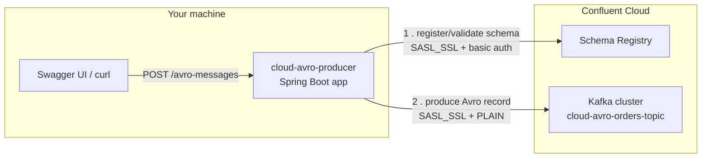

# Cloud Avro Producer — Learning Project

A Spring Boot Avro producer that talks to **Confluent Cloud** (a managed
Kafka + Schema Registry service) instead of a local broker — the natural
next step after
[`spring-producer-demo`](https://github.com/DuminduChamal/spring-producer-demo),
which only ever ran against `localhost:9092`. Exposes a REST endpoint
(with Swagger UI) so messages can be triggered on demand, either running
locally or as a Docker container.

## Architecture



The app runs either directly on your machine (`mvn spring-boot:run`) or as
a Docker container — both reach Confluent Cloud identically, over the
public internet, using the same environment-variable-supplied credentials.
No local Kafka broker or Schema Registry is involved at all.

## Prerequisites

- **Java 17+**
- **Maven**
- **A Confluent Cloud account**, with:
  - A Basic cluster
  - A Kafka API key/secret for that cluster
  - Schema Registry enabled for the environment, with its own API key/secret
  - A topic named `cloud-avro-orders-topic`

## Configuration

`src/main/resources/application.properties` reads every connection detail
from environment variables — nothing is hardcoded:

```properties
spring.kafka.bootstrap-servers=${BOOTSTRAP_SERVERS}
spring.kafka.properties.security.protocol=SASL_SSL
spring.kafka.properties.sasl.mechanism=PLAIN
spring.kafka.properties.sasl.jaas.config=org.apache.kafka.common.security.plain.PlainLoginModule required username="${CLUSTER_API_KEY}" password="${CLUSTER_API_SECRET}";
spring.kafka.producer.key-serializer=org.apache.kafka.common.serialization.StringSerializer
spring.kafka.producer.value-serializer=io.confluent.kafka.serializers.KafkaAvroSerializer
spring.kafka.properties.schema.registry.url=${SCHEMA_REGISTRY_URL}
spring.kafka.properties.basic.auth.credentials.source=USER_INFO
spring.kafka.properties.basic.auth.user.info=${SR_API_KEY}:${SR_API_SECRET}
```

Since this app only ever produces `OrderEventAvro` — unlike
`spring-producer-demo`, which mixed `String` and Avro in one app — the
default auto-configured `KafkaTemplate` bean is already the right type.
No dual `ProducerFactory`/`KafkaTemplate` bean pair, no
`@ConditionalOnMissingBean` gotcha to route around this time.

Create a `.env` file in the project root (never committed — see
`.gitignore`) with your real Confluent Cloud values:

```
BOOTSTRAP_SERVERS=pkc-xxxxx.region.provider.confluent.cloud:9092
CLUSTER_API_KEY=your-cluster-api-key
CLUSTER_API_SECRET=your-cluster-api-secret
SCHEMA_REGISTRY_URL=https://psrc-xxxxx.region.provider.confluent.cloud
SR_API_KEY=your-sr-api-key
SR_API_SECRET=your-sr-api-secret
```

## Why `OrderEventAvro` lives in `dto/`, unlike the local projects

In the four local-broker projects, the generated `OrderEventAvro` class
deliberately stays at the **root** package, because moving it would change
its schema's `namespace` and break `consumer-demo`/`spring-consumer-demo`'s
already-deployed `specific.avro.reader`-based resolution of messages on the
*local* topic.

This project is a clean slate — a brand-new pair (this producer +
`cloud-avro-consumer`) reading/writing a topic no other project touches.
There's no existing consumer to break, so `OrderEventAvro.avsc`'s
`namespace` is set to `com.learning.kafka.dto`, and the generated class
lives at `src/main/java/com/learning/kafka/dto/OrderEventAvro.java`. The
one rule that carries over: `cloud-avro-consumer` **must** use the same
namespace, or it won't resolve this producer's messages.

## Running it

### Locally

```bash
export $(grep -v '^#' .env | xargs)
mvn compile
mvn spring-boot:run
```

### Via Swagger UI

Open `http://localhost:8080/swagger-ui.html`, expand `POST
/avro-messages`, "Try it out", fill in the pre-filled example fields, and
execute.

### Via curl

```bash
curl -X POST http://localhost:8080/avro-messages \
  -H "Content-Type: application/json" \
  -d '{"orderId": "order-cloud-1", "amount": 55.00, "customerId": "cust-cloud"}'
```

## Verifying it reached Confluent Cloud

In the Confluent Cloud UI: **Cluster → Topics → `cloud-avro-orders-topic` →
Messages** should show the record. **Environment → Schema Registry**
should show a registered schema for subject
`cloud-avro-orders-topic-value`.

## What's next

- Containerizing this app with a multi-stage `Dockerfile`, so it can run
  as a container reaching Confluent Cloud the same way, purely via
  `--env-file`
- `cloud-avro-consumer` — the mirrored consumer side, reading this
  producer's messages back out
- Docker Compose to run both together with one command
